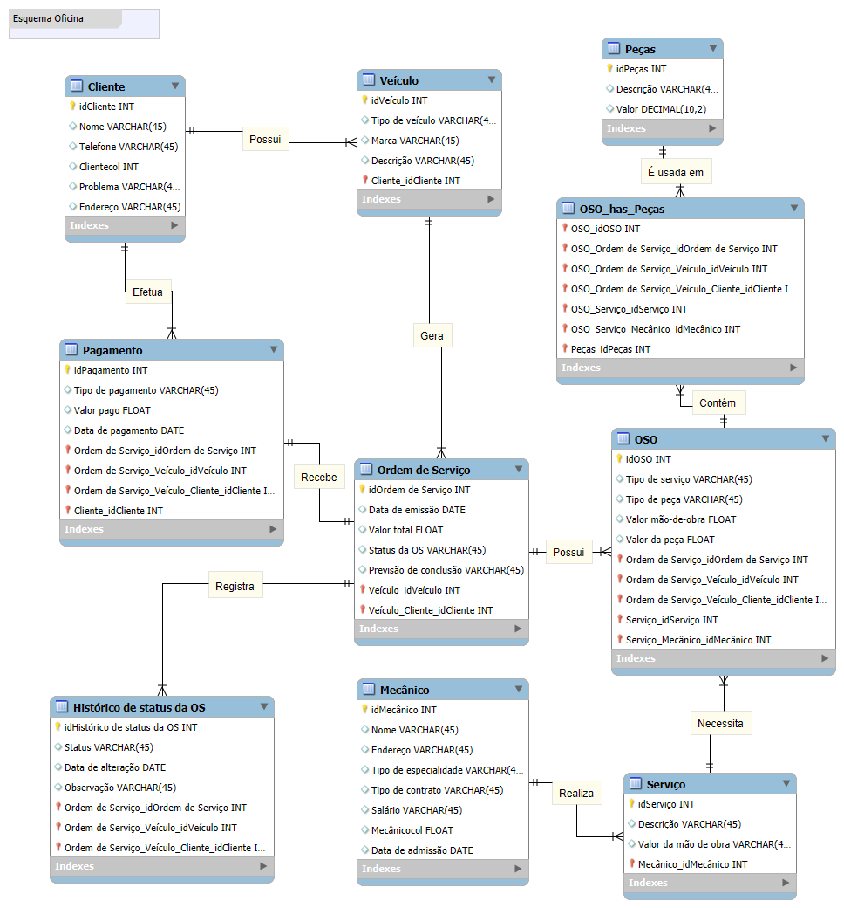

# Desafios_DIO_Database

# Desafio DIO - Esquema Conceitual de Oficina Mecânica com MySQL

Este repositório contém a resolução do desafio proposto no **Bootcamp Randstad - Análise de Dados da DIO**.

## 📊 Diagrama Entidade-Relacionamento (DER)

O modelo foi construído para representar um sistema de uma Oficna Mecânica, contemplando clientes, serviços, veículos, pagamentos, mecânicos e entre outros.

## 📚 Aprendizado
Este desafio ajudou a reforçar:
- Modelagem conceitual e lógica de bancos de dados relacionais.
- Definição de relacionamentos entre entidades.
- Boas práticas na organização de tabelas.
